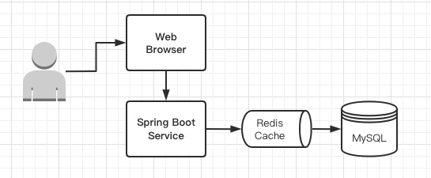
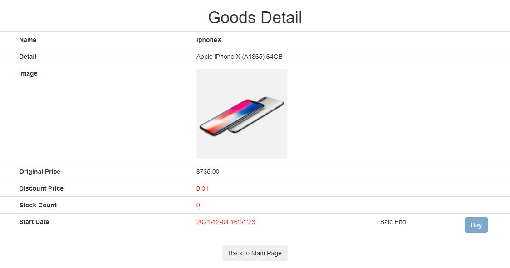
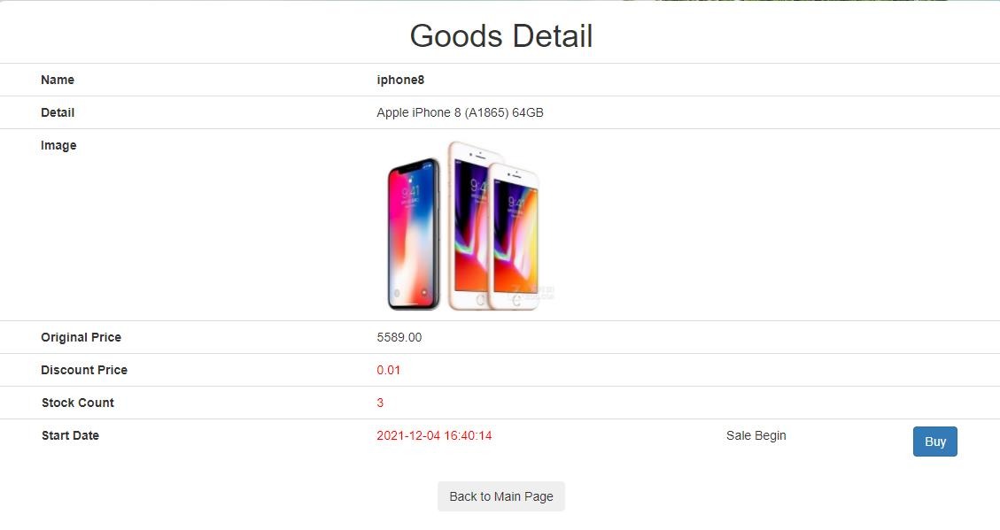
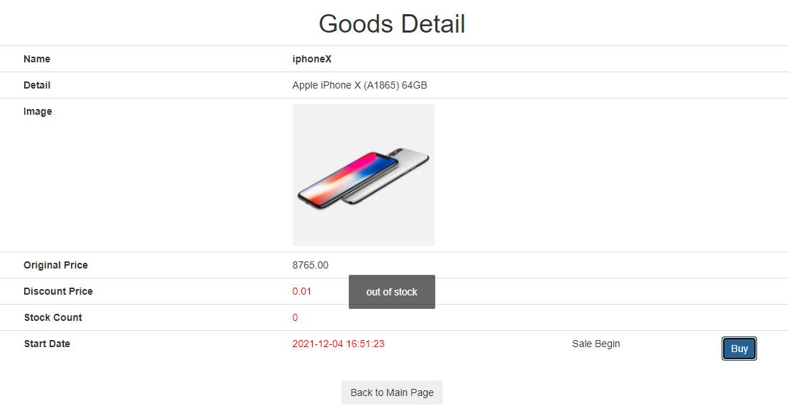
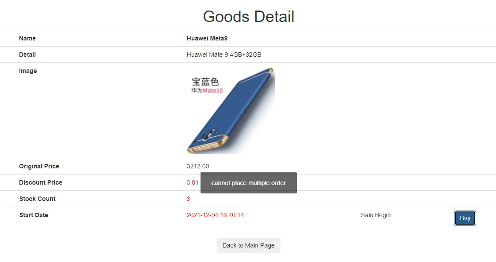
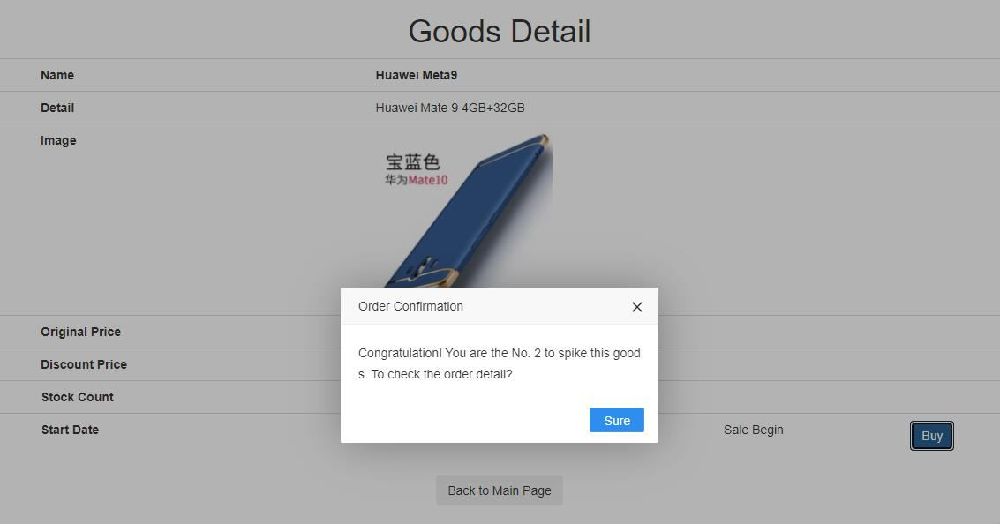
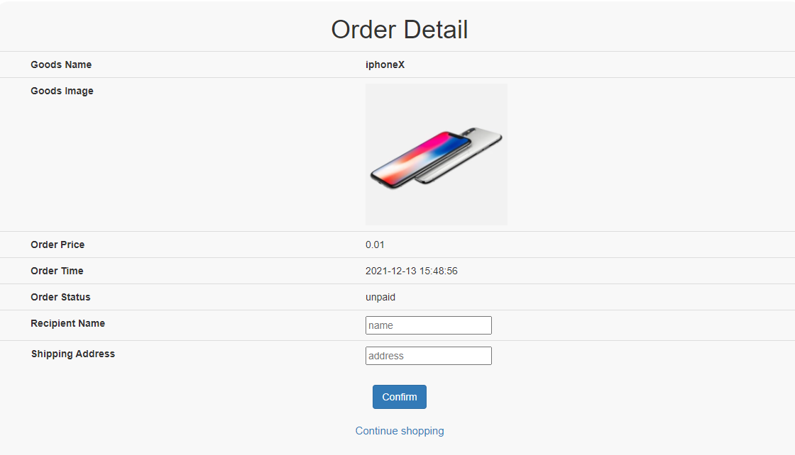
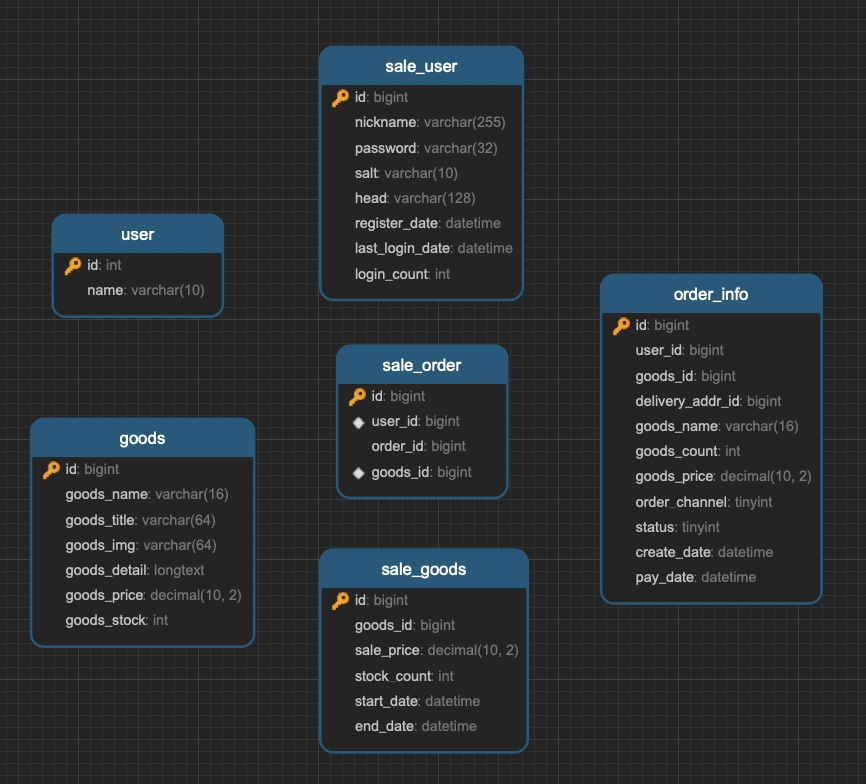

[toc]

# E-commerce system for spike sale

A online shopping web application based on Spring Boot, Redis, MySQL with native HTML5, CSS, JavaScript frontend.



- Video：
[](https://www.youtube.com/watch?v=sAzg0SmN4Mg)
## Function
- user login/register page
     
     

When user do login or register, a random salt will be added to the password and then use MD5 (a cryptographic hash algorithm) to get a fixed length string value sent to the server.

After authentication on the server side, the server will generate a random UUID as token and add it to the cookie. Also, we set the token value as key and user object as value in the Redis to maintain a session between client and server.

Everytime there is a request that need user has been logged in, we can verify the token from cookie by comparing the value from Redis. Once the authentication is success, we can access the user information and associate with a specific order. This is implemented by Interceptor that handles request before controller.

We also use ThreadLocal to set and get user object, which has per-thread data that cannot be accessed concurrently by other threads.


- sales goods page
 

To show all the goods on sale, we integrate Thymeleaf in Spring Boot. It applies a set of transformations to template files in order to display data or text produced by the application. The first time query of these goods information, we can put them into Redis in order to facilitate the following repeat query like display the detail of each goods.
We have a navbar for this page, the user logout will direct the user to the login page. The orderList link will show user all their orders in the orderListPage.


- place order page

   
   
   

When looking up the detail of a product. If the current time is later than start time of the sale, there will be a timer that counts down the remaining seconds. When the sale begins, user can click the Buy button to place an order. When the sale ends or stock count is 0, buy button will be disabled.


- order detail page
  
  
  
  

If the good is out of stock, user cannot place the order. There will be alert of "out of stock". In our system, the user cannot place multiple orders.It will show the alert if user have already bought the good. If succcesfully placed an order, it will show "you are the No. XXX to spike this product".Then you can check the detail of your order and enter your name and address. 

## DB Schema

- MySQL relational database 

  
  

We deploy our MySQL with the help of Docker container. 

```bash
docker run --name mysql -p 3306:3306 -e MYSQL_ROOT_PASSWORD=my-secret-pw -d mysql:latest
```
- mysql

  ```
  Port           : 3306
  Database       : flash_sale
  ```

  ```sql
  SET FOREIGN_KEY_CHECKS=0;
  
  -- ----------------------------
  -- Table structure for goods
  -- ----------------------------
  DROP TABLE IF EXISTS `goods`;
  CREATE TABLE `goods` (
    `id` bigint(20) NOT NULL AUTO_INCREMENT COMMENT 'ID',
    `goods_name` varchar(16) DEFAULT NULL COMMENT 'name',
    `goods_title` varchar(64) DEFAULT NULL COMMENT 'title',
    `goods_img` varchar(64) DEFAULT NULL COMMENT 'image',
    `goods_detail` longtext COMMENT 'detail',
    `goods_price` decimal(10,2) DEFAULT '0.00' COMMENT 'price',
    `goods_stock` int(11) DEFAULT '0' COMMENT 'stock，-1 represents no limit',
    PRIMARY KEY (`id`)
  ) ENGINE=InnoDB AUTO_INCREMENT=5 DEFAULT CHARSET=utf8mb4;
  
  -- ----------------------------
  -- Records of goods
  -- ----------------------------
  INSERT INTO `goods` VALUES ('1', 'iphoneX', 'Apple iPhone X (A1865) 64GB', '/img/iphonex.png', 'Apple iPhone X (A1865) 64GB', '8765.00', '10000');
  INSERT INTO `goods` VALUES ('2', 'Huawei Meta9', 'Huawei Mate 9 4GB+32GB', '/img/meta10.png', 'Huawei Mate 9 4GB+32GB', '3212.00', '-1');
  INSERT INTO `goods` VALUES ('3', 'iphone8', 'Apple iPhone 8 (A1865) 64GB', '/img/iphone8.png', 'Apple iPhone 8 (A1865) 64GB', '5589.00', '10000');
  INSERT INTO `goods` VALUES ('4', 'Mi 6', 'Mi 6 4GB+32GB', '/img/mi6.png', 'Mi 6 4GB+32GB', '3212.00', '10000');
  ```
  
  ```sql
  -- ----------------------------
  -- Table structure for sale_goods
  -- ----------------------------
  DROP TABLE IF EXISTS `sale_goods`;
  CREATE TABLE `sale_goods` (
    `id` bigint(20) NOT NULL AUTO_INCREMENT COMMENT 'Id',
    `goods_id` bigint(20) DEFAULT NULL COMMENT 'goods Id',
    `sale_price` decimal(10,2) DEFAULT '0.00' COMMENT 'sale price',
    `stock_count` int(11) DEFAULT NULL COMMENT 'stock count',
    `start_date` datetime DEFAULT NULL COMMENT 'sale start time',
    `end_date` datetime DEFAULT NULL COMMENT 'sale end time',
    PRIMARY KEY (`id`)
  ) ENGINE=InnoDB AUTO_INCREMENT=5 DEFAULT CHARSET=utf8mb4;
  
  
  -- ----------------------------
  -- Records of sale_goods
  -- ----------------------------
  INSERT INTO `sale_goods` VALUES ('1', '1', '0.01', '9', '2017-12-04 21:51:23', '2017-12-31 21:51:27');
  INSERT INTO `sale_goods` VALUES ('2', '2', '0.01', '9', '2017-12-04 21:40:14', '2017-12-31 14:00:24');
  INSERT INTO `sale_goods` VALUES ('3', '3', '0.01', '9', '2017-12-04 21:40:14', '2017-12-31 14:00:24');
  INSERT INTO `sale_goods` VALUES ('4', '4', '0.01', '9', '2017-12-04 21:40:14', '2017-12-31 14:00:24');
  ```
  
  ```sql
  -- ----------------------------
  -- Table structure for user
  -- ----------------------------
  DROP TABLE IF EXISTS `user`;
  CREATE TABLE `user` (
    `id` int(11) NOT NULL AUTO_INCREMENT,
    `name` varchar(10) DEFAULT NULL,
    PRIMARY KEY (`id`)
  ) ENGINE=InnoDB AUTO_INCREMENT=2 DEFAULT CHARSET=utf8mb4;
  
  -- ----------------------------
  -- Records of user
  -- ----------------------------
  INSERT INTO `user` VALUES ('1', 'Joshua');
  ```
  
  ```sql
  -- ----------------------------
  -- Table structure for sale_user
  -- ----------------------------
  DROP TABLE IF EXISTS `sale_user`;
  CREATE TABLE `sale_user` (
    `id` bigint(20) NOT NULL AUTO_INCREMENT COMMENT 'ID/phone number',
    `nickname` varchar(255) NOT NULL,
    `password` varchar(32) DEFAULT NULL COMMENT 'MD5(MD5(pass+salt) + salt)',
    `salt` varchar(10) DEFAULT NULL,
    `head` varchar(128) DEFAULT NULL COMMENT 'profile id',
    `register_date` datetime DEFAULT NULL COMMENT 'register date',
    `last_login_date` datetime DEFAULT NULL COMMENT 'last login time',
    `login_count` int(11) DEFAULT '0' COMMENT 'login count',
    PRIMARY KEY (`id`)
  ) ENGINE=InnoDB AUTO_INCREMENT=18912341246 DEFAULT CHARSET=utf8mb4;
  
  -- ----------------------------
  -- Records of sale_user
  -- ----------------------------
  INSERT INTO `sale_user` VALUES ('18912341238', '18612766138', 'b7797cce01b4b131b433b6acf4add449', '1a2b3c4d', null, '2019-01-09 17:08:16', null, '0');
  INSERT INTO `sale_user` VALUES ('18912341239', '18612766139', 'b7797cce01b4b131b433b6acf4add449', '1a2b3c4d', null, '2019-01-09 17:17:21', null, '0');
  INSERT INTO `sale_user` VALUES ('18912341240', '18612766139', 'b7797cce01b4b131b433b6acf4add449', '1a2b3c4d', null, '2019-01-11 11:35:39', null, '0');
  INSERT INTO `sale_user` VALUES ('18912341241', '18612766141', 'b7797cce01b4b131b433b6acf4add449', '1a2b3c4d', null, '2019-01-11 11:36:23', null, '0');
  INSERT INTO `sale_user` VALUES ('18912341242', '18612766145', 'b7797cce01b4b131b433b6acf4add449', '1a2b3c4d', null, '2019-01-11 11:38:29', null, '0');
  INSERT INTO `sale_user` VALUES ('18912341243', '18612766122', 'b7797cce01b4b131b433b6acf4add449', '1a2b3c4d', null, '2019-01-11 11:41:52', null, '0');
  INSERT INTO `sale_user` VALUES ('18912341244', '18612766133', 'b7797cce01b4b131b433b6acf4add449', '1a2b3c4d', null, '2019-01-11 11:43:24', null, '0');
  INSERT INTO `sale_user` VALUES ('18912341245', '18612766444', 'b7797cce01b4b131b433b6acf4add449', '1a2b3c4d', null, '2019-01-11 13:44:29', null, '0');
  ```
  
  ```sql
  -- ----------------------------
  -- Table structure for order_info
  -- ----------------------------
  DROP TABLE IF EXISTS `order_info`;
  CREATE TABLE `order_info` (
    `id` bigint(20) NOT NULL AUTO_INCREMENT,
    `user_id` bigint(20) DEFAULT NULL COMMENT 'user ID',
    `goods_id` bigint(20) DEFAULT NULL COMMENT 'goods ID',
    `delivery_addr_id` bigint(20) DEFAULT NULL COMMENT 'delivery address ID',
    `goods_name` varchar(16) DEFAULT NULL COMMENT 'goods name',
    `goods_count` int(11) DEFAULT '0' COMMENT 'goods count',
    `goods_price` decimal(10,2) DEFAULT '0.00' COMMENT 'goods price',
    `order_channel` tinyint(4) DEFAULT '0' COMMENT '1pc，2android，3ios',
    `status` tinyint(4) DEFAULT '0' COMMENT '0 no pay, 1 paid，2 sent，3 received，4 returned，5 finished',
    `create_date` datetime DEFAULT NULL COMMENT 'order create time',
    `pay_date` datetime DEFAULT NULL COMMENT 'payment date',
    PRIMARY KEY (`id`)
  ) ENGINE=InnoDB AUTO_INCREMENT=1565 DEFAULT CHARSET=utf8mb4;
  
  -- ----------------------------
  -- Records of order_info
  -- ----------------------------
  INSERT INTO `order_info` VALUES ('1561', '18912341234', '1', null, 'iphoneX', '1', '0.01', '1', '0', '2017-12-14 22:49:10', null);
  INSERT INTO `order_info` VALUES ('1562', '18912341234', '2', null, 'HUAWEi Meta9', '1', '0.01', '1', '0', '2017-12-14 22:55:42', null);
  INSERT INTO `order_info` VALUES ('1563', '18912341234', '4', null, 'Xiaomi 6', '1', '0.01', '1', '0', '2017-12-16 16:19:23', null);
  INSERT INTO `order_info` VALUES ('1564', '18912341234', '3', null, 'iphone8', '1', '0.01', '1', '0', '2017-12-16 16:35:20', null);
  ```
  
  ```sql
  -- ----------------------------
  -- Table structure for sale_order
  -- ----------------------------
  DROP TABLE IF EXISTS `sale_order`;
  CREATE TABLE `sale_order` (
    `id` bigint(20) NOT NULL AUTO_INCREMENT,
    `user_id` bigint(20) DEFAULT NULL COMMENT 'user ID',
    `order_id` bigint(20) DEFAULT NULL COMMENT 'order ID',
    `goods_id` bigint(20) DEFAULT NULL COMMENT 'goods ID',
    PRIMARY KEY (`id`),
    UNIQUE KEY `u_uid_gid` (`user_id`,`goods_id`) USING BTREE
  ) ENGINE=InnoDB AUTO_INCREMENT=1551 DEFAULT CHARSET=utf8mb4;
  
  -- ----------------------------
  -- Records of sale_order
  -- ----------------------------
  INSERT INTO `sale_order` VALUES ('1547', '18912341234', '1561', '1');
  INSERT INTO `sale_order` VALUES ('1548', '18912341234', '1562', '2');
  INSERT INTO `sale_order` VALUES ('1549', '18912341234', '1563', '4');
  INSERT INTO `sale_order` VALUES ('1550', '18912341234', '1564', '3');
  ```


## Directory

- DAO (data access object):  simplifies the implementation of database access by mapping parameter objects to JDBC prepared statement parameters and mapping rows in JDBC result sets to objects.
- VO (View Object): define the objects that update the view and pass to the service.
- Service: business logic implementation of goods, order, user login and register with DAO.
- Controller:  handler the request from the DispatcherServlet. 
- Common: custom the format of response body and define several response statuses for rich error and exceptions handling.
- Access: Interceptor and HandlerMethodArgumentResolver.
- Redis: Redis client API for performing CRUD operations on key-value memory store.
- Util: MD5 hashing for password.


## API 

### login 

/login

1. GET /to_login
2. POST /do_login


### Register

/user

1. GET /do_register
2. POST /register


### Sale

/sale

1. GET /path
1. POST /{path}/do_sale

1. GET /result


### Order

/order

1. GET /detail


### Goods

/goods

1. GET /to_list
2. GET /detail/{goodsid}
3. GET /to_deatil/{goodsid}


## Redis

We deploy Redis with the help of Docker container. 

```bash
docker run --name redis -p 6379:6379 --requirepass=my-secret-pw -d redis:latest
```

Utilize Jedis to open a socket to connect to the Redis service.

Configure the connection pool based on JedisPoolConfig (such as the maximum number of connections, etc..)


